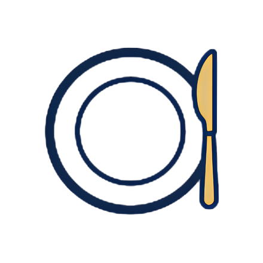

<div align="center">
  

  <h1>Best Table</h1>

  <p><strong>接待・会食向けのレストラン比較を、AI で支援する。</strong></p>

  <p>
    
    
    
    
  </p>
</div>

---

## About

Best Table は、接待・会食のための「お店選び」を AI が後押しするプロダクトです。

- 入口は従来型の MAP / 検索体験を維持
- AI は検索結果の後段で、比較・要約・説明・不安解消に使う
- 汎用的なレストラン探索ではなく、**納得して予約判断へ進めること**を重視

プロダクト仕様やアーキテクチャは README ではなく `docs/` 配下で管理しています。詳細は [AGENTS.md](AGENTS.md) を参照してください。

| ドキュメント | 内容 |
| --- | --- |
| [`docs/DESIGN.md`](docs/DESIGN.md) | プロダクト仕様、ユーザーフロー、画面設計 |
| [`docs/ARCHITECTURE.md`](docs/ARCHITECTURE.md) | コード配置、状態モデル、AI 実装ルール |
| [`docs/plans/<cycle>/PLANS.md`](docs/STATUS.md) | 実装マイルストーン（サイクルごとに定義。現行サイクルは `docs/STATUS.md` を参照） |
| [`docs/RELIABILITY.md`](docs/RELIABILITY.md) | AI の根拠付け、キャッシュ、障害時の振る舞い |
| [`docs/SECURITY.md`](docs/SECURITY.md) | センシティブ入力、プロンプトインジェクション対策 |

---

## Getting Started

```bash
pnpm install
pnpm dev
```

`http://localhost:5173` で起動します。

## Verify

```bash
pnpm run typecheck
pnpm build
```
